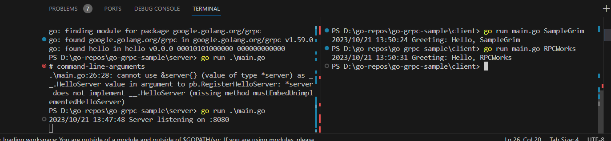

# go-grpc-sample

## Table of Contents

+ [Summary](#summary)
+ [References](#references)
+ [How to use](#how-to-use)

## Summary

A repository demonstrating the use of the RPC protocol trough go gRPC

## References

- [Configure Visual Studio Code for Go development](https://learn.microsoft.com/en-us/azure/developer/go/configure-visual-studio-code)
- [gRPC Quick Start](https://grpc.io/docs/languages/go/quickstart/)
- [Protocol Buffer Compiler Installation](https://grpc.io/docs/protoc-installation/)

## How to use

**0. Setup**

Go trough the provided links in the [References section](#references).

**1. Compiling the proto file**

A  [hello.proto file](./proto/hello.proto) is manually created in the form of:

```sh
syntax = "proto3";

package sample;

option go_package = ".";

service Hello {
  rpc SayHello (HelloRequest) returns (HelloResponse);
}

message HelloRequest {
  string name = 1;
}

message HelloResponse {
  string greeting = 1;
}
```

Execute: 

```sh
cd proto
go mod init hello
protoc.exe --go_out=. --go-grpc_out=. hello.proto
go mod tidy
cd ..
```

This will regenerate the [hello_grpc.pb.go](./proto/hello_grpc.pb.go) and [hello.pb.go](./proto/hello.pb.go) files, which contain:
- Code for populating, serializing, and retrieving HelloRequest and HelloReply message types.
- Generated client and server code.

**2. Setting up client and server code utilizing outputs of proto file compilation**

For the client code following steps where executed:

```sh
mkdir -vp client
cd client
go mod init main
# create and implement the main.go (consider go package in proto folder as local dependency)
# update go.mod file
go mod tidy
```

For the server code following steps where executed:

```sh
mkdir -vp server
cd server
go mod init main
# create and implement the main.go (consider go package in proto folder as local dependency)
# update go.mod file
go mod tidy
```

**3. Compile and run code**

Following steps can be executed *repeatedly*.

Ramp up the gRPC server in 1 terminal process:

```sh
cd server
go run main.go
```

Run the gRPC client in another terminal process:

```sh
cd client
go run main.go SampleGrim
```

Results should look similair to:




