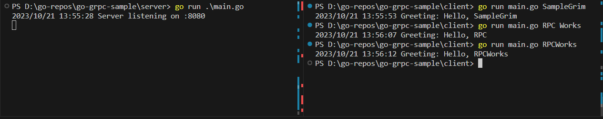
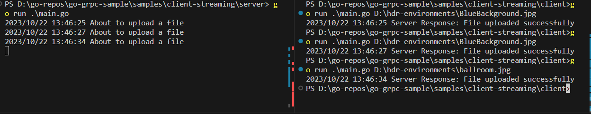

# go-grpc-sample

## Table of Contents

+ [Summary](#summary)
+ [References](#references)
+ [History](#history)
+ [How to use](#how-to-use)

## Summary

A repository demonstrating the use of the RPC protocol trough go gRPC

## References

- [Configure Visual Studio Code for Go development](https://learn.microsoft.com/en-us/azure/developer/go/configure-visual-studio-code)
- [gRPC Quick Start](https://grpc.io/docs/languages/go/quickstart/)
- [Protocol Buffer Compiler Installation](https://grpc.io/docs/protoc-installation/)
- [helloworld sample](https://github.com/grpc/grpc-go/tree/master/examples/helloworld)

## History

Following steps *shall not be executed*. This section tracks all the preconditional steps taken in order to utilize go gRPC. In order to test the samples skip to the [How to use](#how-to-use) section. The steps from **1. Compiling the proto file** will be described for [samples/unary-rpc/](./samples/unary-rpc/) and is applied similairly to any of the other existing [samples](./samples/).

### Setup

Go trough the provided links in the [References section](#references).

### Compiling the proto file

A  [hello.proto file](./samples/unary-rpc/proto/hello.proto) is manually created in the form of:

```sh
syntax = "proto3";

package sample;

option go_package = ".";

service Hello {
  rpc SayHello (HelloRequest) returns (HelloResponse);
}

message HelloRequest {
  string name = 1;
}

message HelloResponse {
  string greeting = 1;
}
```

Execute: 

```sh
cd proto
go mod init hello # should create a `go.mod` file
protoc.exe --go_out=. --go-grpc_out=. hello.proto
go mod tidy # should create a `go.sum` file
cd ..
```

This will regenerate the [hello_grpc.pb.go](./samples/unary-rpc/proto/hello_grpc.pb.go) and [hello.pb.go](./samples/unary-rpc/proto/hello.pb.go) files, which contain:
- Code for populating, serializing, and retrieving HelloRequest and HelloReply message types.
- Generated client and server code.

### Setting up client and server code utilizing outputs of proto file compilation

For the client code following steps where executed:

```sh
mkdir -vp client
cd client
go mod init main # should create a `go.mod` file
# create and implement the main.go (consider go package in proto folder as local dependency)
# update go.mod file to refer to the local go package in proto folder `replace hello => ../proto`
go mod tidy # should create a `go.sum` file
```

For the server code following steps where executed:

```sh
mkdir -vp server
cd server
go mod init main # should create a `go.mod` file
# create and implement the main.go (consider go package in proto folder as local dependency)
# update go.mod file to refer to the local go package in proto folder `replace hello => ../proto`
go mod tidy # should create a `go.sum` file
```

## How to use

Following steps can be executed *repeatedly*.

### unary-rpc sample

Ramp up the gRPC server for the [unary-rpc sample](./samples/unary-rpc/) in one of the samples implementations in 1 terminal process, e.g. :

```sh
cd samples/unary-rpc/server
go run main.go
```

Run the gRPC client for the [unary-rpc sample](./samples/unary-rpc/) in one of the samples implementations in another terminal process, e.g.:

```sh
cd samples/unary-rpc/client
# Sample
go run main.go -n SampleGrim 
go run main.go --name SampleGrim 
```

The result should look for [samples/unary-rpc/](./samples/unary-rpc/) similair to:



### client-streaming sample

Ramp up the gRPC server for the [client-streaming sample](./samples/client-streaming/) in one of the samples implementations in 1 terminal process, e.g. :

```sh
cd samples/client-streaming/server
go run main.go
```

Run the gRPC client for the [client-streaming sample](./samples/client-streaming/) in one of the samples implementations in another terminal process, e.g.:

```sh
cd samples/client-streaming/client
# Sample
go run main.go -p <some upload file path on your filesystem> 
go run main.go --path <some upload file path on your filesystem> 
```

The result should look for [samples/client-streaming/](./samples/client-streaming/) similair to:




